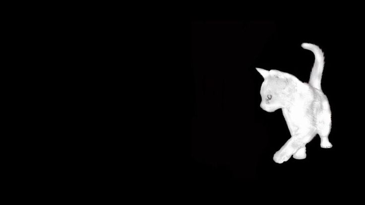

<div align="center">
  

  <h3>hey, i'm sam (@chi0sk)</h3>
  <p>16. writing code mostly in luau and c++.</p>
</div>

---

<h3 align="center"> contact</h3>

<div align="center">
  <b>discord:</b> <code>rituals._</code><br>
  <b>roblox:</b> <a href="https://www.roblox.com/users/profile?username=chi0sk">chi0sk</a>
</div>

---

<h3 align="center"> tech</h3>

<p align="center">
  
  
  
  
</p>

---

<h3 align="center"> currently building</h3>

<div align="center">

#### [sift](https://github.com/chi0sk/sift)

a roblox luau bytecode decompiler focused on readable, source-shaped output.

the whole point is getting back code that actually looks like something a person wrote: better locals, better helper recovery, cleaner module tables, and less opcode soup.

right now i'm pushing it against real roblox bytecode dumps and tightening the output until it's as close to the original source as i can get it.

long term i want to expose it through an api once the output quality is good enough to stand on its own.

<br>

<details>
<summary><b>view decompilation example</b></summary>
<div align="left">

<br>

**real sift output from a roblox `toolHandler` module:**

```lua
local activeCooldowns = {}
local toolHandler = {}

function toolHandler:getConfig(toolName)
	local configModule = script._configs:FindFirstChild(toolName .. ".lua")
	if not configModule then
		return nil
	end
	return require(configModule)
end

function toolHandler:canSwing(player, config)
	local now = os.clock()
	activeCooldowns[player] = activeCooldowns[player] or 0
	if now - activeCooldowns[player] < config.Cooldown then
		return false
	end
	activeCooldowns[player] = now
	return true
end

function toolHandler:getTargets(character, config)
	local root = character:FindFirstChild("HumanoidRootPart")
	if not root then
		return {}
	end

	local params = OverlapParams.new()
	params.FilterType = Enum.RaycastFilterType.Exclude
	params.FilterDescendantsInstances = { character }

	local boxCFrame = root.CFrame * config.Hitbox.Offset
	local parts = workspace:GetPartBoundsInBox(boxCFrame, config.Hitbox.Size, params)
	local targets = {}

	for _, part in parts do
		local model = part:FindFirstAncestorOfClass("Model")
		if model then
			local hum = model:FindFirstChild("Humanoid")
			if hum and hum.Health > 0 then
				targets[hum] = model
			end
		end
	end

	return targets
end

return toolHandler
```

</div>
</details>

</div>
